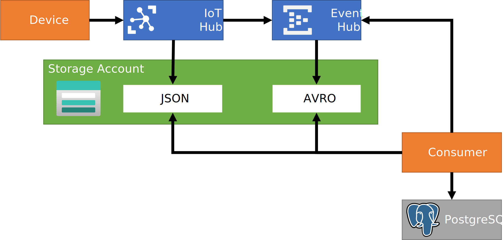

# azure_iothub_eventhub_capture_bicep

This sample demonstrates a few things

- An Azure IoT Hub receives messages from IoT devices
- The IoT Hub has two routes configured: 
  - The messages are routed into an Azure Storage account container in JSON format
  - The messages are routed into a subsequent Azure Event Hub
    - The messages arriving in Event Hub are captured using EventHub capture in an Azure Storage account in Avro format
    - Consumers can fetch from EventHub using the Kafka interface
- The three services (IoT Hub, Event Hub and Storage account) are deployed and wired together using an Azure Bicep file (which compiles down  wo a regular ARM template) 

## Architecture



## demo setup


```bash
#!/bin/bash

resourceGroupName="b"

az group create \
  --name "${resourceGroupName}" \
  --location westeurope

az deployment group create \
  --resource-group "${resourceGroupName}" \
  --template-file ./azuredeploy.bicep


# subscriptionId="$(az account show | jq -r .id)"
# resourceGroupName="b"

# url="/subscriptions/${subscriptionId}/resourceGroups/${resourceGroupName}/providers/Microsoft.Devices/IotHubs/${iotHubName}/routing/routes/\$testall?api-version=2018-04-01"

# body="$( echo "{}" \
#     | jq  ".routingSource=\"DeviceMessages\"" \
#     | jq  ".message.body=\"Hallo\"" \
#     | jq  ".message.appProperties={}" \
#     | jq  ".message.systemProperties={}" \
#     )"

# az rest --method post --url "${url}" --body "${body}"

# https://docs.microsoft.com/en-us/azure/iot-hub/quickstart-send-telemetry-cli

deviceid='simulatedDevice'

az iot hub device-identity create \
    --device-id "${deviceid}" \
    --hub-name "${iotHubName}"

az iot device send-d2c-message \
    --resource-group "${resourceGroupName}" \
    --hub-name "${iotHubName}" \
    --msg-count 200 \
    --device-id "${deviceid}"
```

